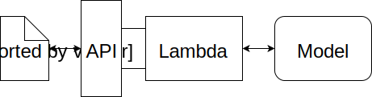

# Deploying a Sentiment Analysis Model on AWS Sagemaker

This repo is a solution to the project, Deploying a Sentiment Analysis Model, for Udacity Machine Learning Engineer Nano Degree.

This project aims to deploy an machine learning model that makes prediction on movie reviews posted on a webpage in real time. Any user can enter movie reviews on a simple web app. The web app sends that the review data to an endpoint, created using AWS API Gateway. Then, the API Gateway sends the data to a Lambda function, which will process the review data and send the data to the deployed model's endpoint. The deployed model perform inference on the processed data and returns the inference results to the Lambda function. Finally, the Lambda function sends back the results to the web app through the API Gateway.

The model is a LSTM classifier trained by Pytorch.
